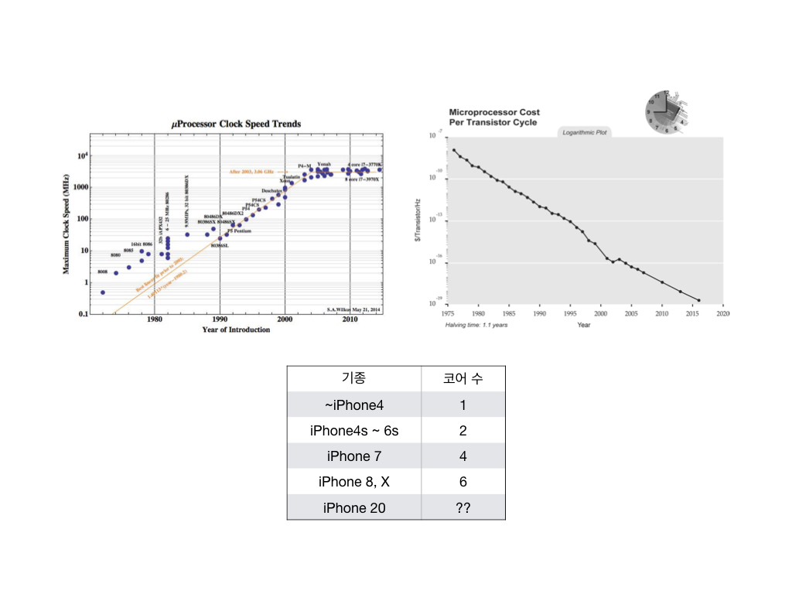

* 우리가 DRFA를 사용해야 하는 이유
* 뤼이드 iOS 챕터의 DRFA를 소개합니다

1. 시작
2. 선언적(Declarative)이란 무엇인가
3. 왜 선언적으로 개발을 해야 하는가
4. 반응적(Reactive)이란 무엇인가
5. 왜 반응적으로 개발을 해야 하는가
6. 함수적(Functional)이란 무엇인가
7. 왜 함수적으로 개발을 해야 하는가
8. 마치며

## 시작하며

제가 속해있는 iOS 챕터는 `DRFA`라는 하나의 철학을 가지고 같은 방향으로 움직이고 있습니다.
그리고 처음 오신 분에게 이 철학에 대해 알려주고 왜 우리가 이 방향으로 가는지에 대해 설명하는 키노트 시간을 매번 가지고 있습니다.
저는 지금 회사에 오기전엔 명령형 프로그래밍을 주로 해왔었기 때문에 이 키노트 시간을 가졌는데, 오늘은 이 키노트 내용과 필기했던 내용을 합쳐서 글로 써보려고 합니다.

`DRFA`는 `Declarative Reactive Functional iOS Application Architecture`의 줄임말로, 코드를 더 선언형이고 반응형이며 함수형으로 만드는 것을 의미합니다.
선언형, 반응형, 함수형은 무엇이며 왜 그런 프로그래밍을 해야할까요?
지금부터 알아보도록 하겠습니다.

## 선언형(Declarative) 프로그래밍이란 무엇일까요?

> In computer science, declarative programming is a programming paradigm — a style of building the structure and elements of computer programs — that expresses the logic of a computation without describing its control flow. - Wikipedia

```
let label = UILabel()
label.textColor = .red
label.textAlignment = .center
```

위 코드는 레이블을 만들고 직접 텍스트의 색상이나 정렬을 지정하기 때문에 흔한 명령형 프로그래밍의 방식입니다.

```
struct LabelStyle {
    let textColor: UIColor
    let textAlignment: NSTextAlignment
}

func labelStyle(with color: UIColor, and alignment: NSTextAlignment) -> LabelStyle {
    return LabelStyle.init(
        textColor: color,
        textAlignment: alignment
    )
}

func run(label: UILabel, with style: LabelStyle) {
    label.textColor = style.textColor
    label.textAlignment = style.textAlignment
}

let label = UILabel()
let style = labelStyle(with: .red, and: .center)

run(label: label, with: style)
```

위 코드는 하고자 하는 일(`labelStyle`)을 데이터로 담아두고 실행기가 그 데이터를 대신 실행(`run()`)하기 떄문에 선언형 프로그래밍의 방식이라고 할 수 있습니다.
실제 프로젝트에선 스타일과 실행기는 이미 만들어져있고 우리가 작성하는 코드는 마지막 세 줄일 것입니다.

이렇게 선연형 프로그래밍은 어떤 작업을 해야할 때 "어떻게" 해야하는지 보다는 "무엇을" 해야하는지에 집중할 수 있는 방식입니다.

## 왜 선언형 프로그래밍일까요?

우리 프로그래머들은 현실의 문제를 컴퓨터를 이용해 해결하는 응용 소프트웨어를 만드는 사람이라고 생각합니다.
응용 소프트웨어를 만들 때는 두 가지를 생각할 수 있는데 하나는 `무엇을 해결할 것인가`와 `어떻게 해결할 것인가`입니다.

기계어가 프로그래밍 언어로 바뀐 것, 사람들이 직접 세팅하고 항상 관리해야했던 데이터 센터에서 관리는 위임하고 서버로 무엇을 할지에만 집중하는 임대형 서비스(ex. AWS)로 옮겨가는 것, 그리고 임대형 서비스에서 Docker와 같은 것으로 바뀐 것은 어떻게 보다는 무엇을 할지라는 선언형의 방식으로 기술이 추상화된 결과라고 볼 수 있습니다.

기술이 발전함에 따라 `어떻게`는 결국 정복될 것이니 우리는 `무엇을`에만 집중하면 됩니다.


## 반응형(Reactive) 프로그래밍이란 무엇일까요?


기존의 반응적이지 않은 프로그래밍에선 한 모듈에서 다른 모듈의 상태를 변경하는 경우가 많았습니다.
위 이미지 `Bar` 모듈을 `Foo` 모듈을 변경하는 경우입니다.
`Bar` 모듈을 `Foo` 모듈이 변경하면 `Bar` 모듈에 대한 변경의 책임이 `Foo` 모듈에 있을 수 밖에 없습니다.


앞서 말씀드린 내용을 코드로 나타내면 아래와 같고, 우리는 이를 Proactive하다고 표현합니다.

```
class Bar {
    func incrementCounter() {}
}

class Foo {
    var bar: Bar = Bar()

    func onNetworkRequest() {
        // ....
        bar.incrementCounter()
        // ....
    }
}
```


Reactive한 방식(반응형)은 `Bar` 모듈의 변경에 대한 책임이 `Bar` 모듈에 있고, `Foo` 모듈은 `Bar` 모듈이 변경됐다는 정보만 알 수 있으며 `Bar` 모듈을 변경할 수 없습니다.
코드로 나타내면 아래와 같이 나타낼 수 있으며, 반응형은 정도의 차이만 있을 뿐 반응형과 상대적으로 덜 반응형인 것이 있다 정도로 생각하면 되겠습니다.

```
class Bar {
    init() {
        Foo.addOnNetworkRequestListener {
            self.incrementCounter()
        }
    }
    
    func incrementCounter() {
        // ....
    }
}

class Foo {
    static func addOnNetworkRequestListener(callback: @escaping () -> ()) {
        // ....
    }
}
```

## 왜 반응형 프로그래밍일까요?

텍스트 필드가 두 개 있고 그 둘의 값을 더한 결과를 보여주는 레이블이 하나 있다고 해보겠습니다.
일단 비교를 위해 명령형 프로그래밍과 반응형 프로그래밍으로 코드를 작성해보겠습니다.

```
@objc func leftOperandFieldDidChange(_ sender: UITextField) {
        guard let number = sender.text.map(Int.init) else { return }
        model.leftOperand = number
        resultLabel.text = model.result?.description
}
    
@objc func rightOperandFieldDidChange(_ sender: UITextField) {
        guard let number = sender.text.map(Int.init) else { return }
        model.rightOperand = number
        resultLabel.text = model.result?.description
}
```

명령형 프로그래밍은 컴퓨터에게 무엇을 해야하는지 하나하나 찍어주는 것과 동일합니다.

```
let leftOperand$ = leftOperandSubject
            .asObservable()
            .map { $0.flatMap(Int.init) }
            .filterNil()
        
let rightOperand$ = rightOperandSubject
            .asObservable()
            .map { $0.flatMap(Int.init) }
            .filterNil()
        
result$ = Observable.combineLatest(leftOperand$, rightOperand$)
            .map(+)
            .map { $0.description }
```

우리가 만드려는 프로그램은 왼쪽 텍스트 필드와 오른쪽 텍스트 필드의 값을 더해서 결과를 보여주는 것입니다.
명령형은 미시적으로 각 함수가 어떤 일을 해야하는지 하나하나 지정하는 것에는 강점을 가지지만, rightOperandFieldDidChange를 작성하지 않는 등의 거시적인 실수를 하기 쉽습니다.
하지만 반응형 프로그래밍의 경우엔 하나의 콜백이라도 빼먹으면 오류가 나기 때문에 어떤 것을 빼먹는 실수를 하기가 상대적으로 힘듭니다.

## 함수형(Functional) 프로그래밍이란 무엇일까요?

```
// f: (A) -> B
// g: (B) -> C
// g . f: (A) -> C

func compose<A, B, C>(_ f: @escaping (A) -> B, _ g: @escaping (B) -> C) -> (A) -> C {
    return { x in
        return g(f(x))
    }
}

func increment(_ x: Int) -> Int {
    return x + 1
}

func square(_ x: Int) -> Int {
    return x * x
}

let incrementAndThenSquare = compose(increment, square)
```

함수형이란 무엇이라고 생각하시나요? 사이드 이펙트가 없는 순수 함수, 데이터의 불변성 등 가장 먼저 생각나는 것들이 있으실거라고 생각합니다.

> 사이드 이펙트가 없는 순수 함수란? 순수 함수는 함수의 결과가 입력 값의 결과에만 의존하는 것. 그런데 함수 안에서 입력값 외에 다른 전역 변수를 참조하거나 변경하는 등의 사이드 이펙트가 실행되면 같은 함수를 같은 인자로 다시 호출했을 때 결과가 다르거나 환경이 바뀐다.

하지만 함수형의 가장 중요한 내용은 `함수를 합성할 수 있다`라고 생각합니다.
합성이 가능하다는 것은 `f`가 `A -> B`이고 `g`가 `B -> C`일 경우 `f`와 `g`의 합성 결과는 `A -> C`가 되는 것을 의미합니다.
함수를 합성할 수 있게 되면 각 함수는 순수 함수여야 하기 때문에 사이드 이펙트가 없을 수 밖에 없습니다.

## 왜 함수형 프로그래밍일까요?

> 무어의 법칙(영어: Moore's law)은 반도체 집적회로의 성능이 24개월마다 2배로 증가한다는 법칙이다. - 위키피디아



* 1900년대 후반부터 2000년대까지는 무어의 법칙으로 인해 단일 CPU의 속도가 엄청나게 발전했음 -> 프로그래머가 알고리즘을 거지같이 짜도 유저가 새로운 기기를 사면 저절로 최적화가 되는 공짜 점심을 먹어왔음
* 이제는 공짜점심이 사라지고 있음
* 이제 단일 CPU의 성능이 늘어나는 시간은 줄었어도 단가가 줄어들고 있기 때문에 많은 자원을 사용하면 된다
ex. 서버의 용량과 성능을 올리는게 아니라 스케일아웃을 한다
* 앞으로는 단일 CPU보다 많은 CPU를 사용했을 때 잘 돌아가도록 만들어야한다

```
The free lunch is over
이제 공짜 점심을 즐기기 위해서는 Concurrency, Parallelism을 극대화할 수 있는 방식으로 소프트웨어를 작성해야 한다
```

* 공짜 점심은 끝났다
* 빠르게 동시성(컨커런시), 병렬성을 극대화할 수 있는 방식으로 소프트웨어를 작성해야 한다

```
protocol ComplexObject {
    func doSomething()
    var getValue: Int { get }
}

class Foo: ComplexObject {
    private var privateValue: Double = 0
    
    func doSomething() {
        // ...
        privateField = 1
        // ...
    }
    
    var getValue: Int {
        return Int(privateValue)
    }
}

let foo = Foo()
let bar = foo

bar.doSomething()

print(bar.getValue) // prints "1"
print(foo.getValue) // prints "1"
```

* 위는 객체 지향 프로그래밍
* 객체 지향 프로그래밍의 단점은 병렬성에 태생적으로 취약한 패러다임임
* 이유
foo를 Foo()로 만들고 bar에 참조 할당을 했음
bar에 doSomething을 했으면
bar도 바뀌고 foo도 바뀜
* 객체지향프로그래밍은 자원을 공유함
-> 데드락이 발생하는 이유 (자원을 공유, 병렬로 자원을 접근)

[image:5C72FA28-B3B2-407C-8204-7AB5F1DFF8FA-31494-00023ECD15AA9EC9/스크린샷 2019-07-31 오후 3.26.36.png]

* 최근에 나온 언어들은 병렬성/비동기성을 더 잘 다룰 수 있는 기능을 포함하고 있음
* 람다 대수 & 엘런 튜링
* 명령형 프로그램은 하나하나 다 지정하기 때문에 자원을 효율적으로 쓸 수 있었음 (엘런 튜링)
* 함수형 프로그램도 람다 대수와 같이 생겼지만 그때는 자원(CPU)이 너무 안좋았기 때문에 어쩔 수 없었지만 이제는 어느정도 퍼포먼스 손실에도 불구하고 병렬을 할 수 있게 됨 (CPU 하나 하나가 너무 좋아졌기 때문에)

## 8. 마치며
```
More declarative
More reactive
More functional
```

* 앞으로는 더 선언적으로, 앞으로는 더 반응적으로, 앞으로는 더 함수적으로

[image:CFBC1DB9-A8AC-442B-ABE2-B903EBCA359B-31494-00023E83A63DF3F5/DRFA.038.jpeg]

* 카테고리 이론, 하스켈을 같이 공부하면 좋다.
* 공부하다보면 러닝 커브 같은 걸림돌이 있을 수 있다.
* 같이 하자

[image:C1CA80AA-CCCE-470A-BFBB-2477E5722AA5-31494-00023E83A6541E68/DRFA.039.jpeg]

* 우리가 기존에 해왔던 것이 a
* 새로운 것을 배우는 시기 b
* 빠르게 c로 넘어갈 수 있다면 더 많은 생산성을 가져갈 수 있다

